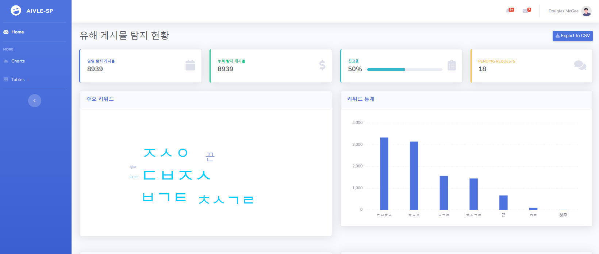
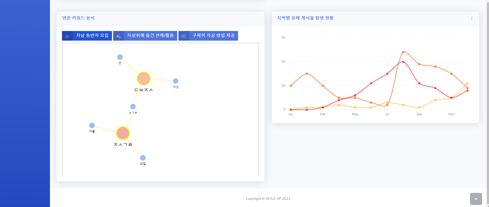

# **Analyzing-Suicide**


### **Flask 웹앱 실행 방법**

1. `webapp/config` 채우기
    - `config/config.json` : database url 및 keyfile 명 작성
    - `config/` 내에 keyfile 저장


2. command 실행
    ```
    python run.py
    ```


### **22.10.28 웹 페이지 구성**




