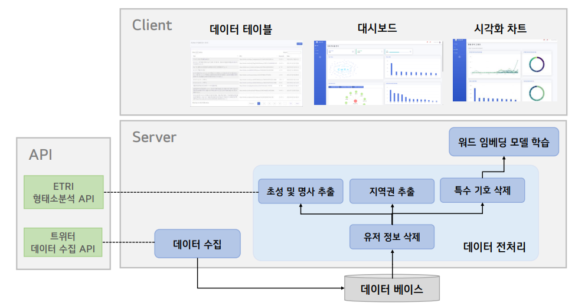

# **지켜줌인(人) AI**


2022 ETRI 오픈 API 활용 사례 공모전 출품작  


<br>


## **자살유발 유해 게시물 분석 프레임워크**


온라인에서 무분별하게 확산되고 있는 자살유발 유해 게시물을 모니터링함으로써 소중한 생명들을 살리는데 이바지하고자 기획한 서비스  

* 자살유발 유해 게시물 : 자살 동반자 모집, 자살위해 물건 판매/활용, 구체적 자살 방법 제공

<br>

## **프레임워크 구조**  



<br>


## **실행 방법**


1. `webapp/config` 채우기
    - `config/config.json` : database url 및 keyfile 명 작성
    - `config/` 내에 keyfile 저장

2. webapp 경로로 이동

3. command 실행
    ```
    python run.py
    ```
<br>


## **데모 영상**


<br>


## **Contributor**

<table>
  <tr>
    <td align="center"><a href="https://github.com/Lee-Siyoung"><br /><sub><b>Siyoung Lee</b></sub></td>
    <td align="center"><a href="https://github.com/aqaqsubin"><br /><sub><b>Subin Kim</b></sub></td>
    <td align="center"><a href="https://github.com/songbyungsub"><br /><sub><b>Byungsub Song</b></sub></td>
    <td align="center"><a href="https://github.com/hyeonju0121"><br /><sub><b>Hyeonju Yu</b></sub></td>
  </tr>
</table>
